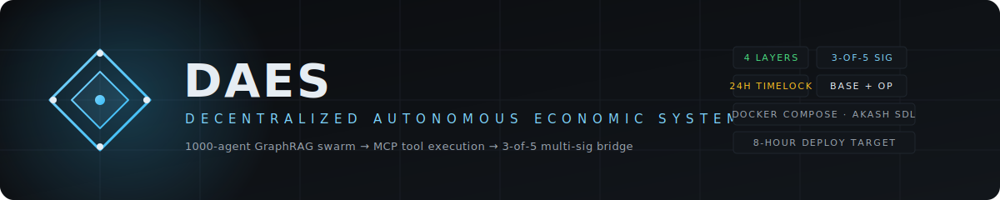

<p align="center">
  
</p>

<h1 align="center">DAES · Sovereign Economy</h1>

<p align="center">
  <b>A Decentralized Autonomous Economic System.</b><br/>
  2000-agent GraphRAG swarm → MCP tool execution → 3-of-5 multi-sig bridge → containerised deploy.
</p>

<p align="center">
  <a href="https://frontend-eight-pearl-52.vercel.app"></a>
  <a href="#hard-constraint-compliance"></a>
  <a href="#safety-architecture-at-a-glance"></a>
  <a href="#safety-architecture-at-a-glance"></a>
  <a href="deploy/docker-compose.yaml"></a>
  <a href="deploy/akash/deploy.yaml"></a>
  <a href="frontend"></a>
</p>

<p align="center">
  <a href="https://frontend-eight-pearl-52.vercel.app"><b>🔗 Live operator console →</b></a>
</p>

---

## About

**DAES** is a four-layer reference architecture for running an autonomous on-chain economy end-to-end: a deterministic
swarm of 2000 agents reasons over a GraphRAG index, submits validated signals through an MCP tool-execution plane,
and — only after clearing four independent safety stops — moves capital through a 3-of-5 multi-sig bridge between
Base and Optimism.

Every component has an OSS fallback. Every action is idempotent, deterministic, and replayable. The evaluation target
is deliberate: **a senior engineer can stand the whole thing up in under 8 hours.**

<table>
  <tr>
    <td align="center" valign="middle" width="180">
      
    </td>
    <td valign="middle">
      <table>
        <tr>
          <td><b>Layer 1 · Cognition</b></td>
          <td><code>agent-swarm-runtime</code> · <code>graph-rag-indexer</code></td>
        </tr>
        <tr>
          <td><b>Layer 2 · Action</b></td>
          <td><code>mcp-gateway</code> · <code>goose-executor</code></td>
        </tr>
        <tr>
          <td><b>Layer 3 · Settlement</b></td>
          <td>Solidity — Governor · BridgeExecutor · CircuitBreaker · AgentAccountFactory · DaesOApp</td>
        </tr>
        <tr>
          <td><b>Layer 4 · Operations</b></td>
          <td>Next.js 15 + wagmi v2 operator console · Grafana · Prometheus</td>
        </tr>
      </table>
    </td>
  </tr>
</table>

---

## The five deliverables

| # | Artifact | Path |
|---|----------|------|
| 1 | Mermaid architecture diagram | [docs/architecture.md](docs/architecture.md) |
| 2 | Component spec YAML · single source of truth | [spec/components.yaml](spec/components.yaml) |
| 3 | Solidity interfaces + reference impls + ABI JSONs | [contracts/interfaces/](contracts/interfaces/) · [contracts/src/](contracts/src/) · [contracts/abi/](contracts/abi/) |
| 4 | `docker-compose.yaml` | [deploy/docker-compose.yaml](deploy/docker-compose.yaml) |
| 5 | Akash SDL manifest | [deploy/akash/deploy.yaml](deploy/akash/deploy.yaml) |

## Hard constraint compliance

- **No proprietary API without OSS fallback** — every `sources[].fallback` field in `spec/components.yaml` is populated. text-embedding-3-large → BGE-large + linear adapter; Chainlink → Pyth/Chronicle/Uniswap-TWAP 3-of-3 median; DHL/Maersk → GDELT/OSM/AIS; Tenderly → Anvil fork; Pimlico → Stackup self-hosted.
- **Deterministic agent logic** — `services/agent-swarm-runtime/src/determinism.py` wraps a `numpy.SeedSequence`; `tests/test_determinism.py` asserts same seed ⇒ same `state_hash`. Seeds come from Chainlink VRF in prod, drand as fallback.
- **No single point of failure** — `graph-rag-indexer` and `mcp-gateway` run `replicas: 2` (Compose `deploy.replicas`, Akash `count: 2`). Bridge has 4 independent stop mechanisms: FSM, multi-sig, timelock, circuit breaker.
- **Fenced code with filename headers** — every source file begins with a `# path/to/file` header.

## Operator console

The Next.js 15 + wagmi v2 console at [`frontend/`](frontend/) exposes four views:

| Route | Purpose |
|-------|---------|
| [`/`](frontend/app/page.tsx)                 | Service-health dashboard · Grafana embed · quick links |
| [`/bridge`](frontend/app/bridge/page.tsx)     | Signal probe · 8-state FSM visualiser · stage for multi-sig |
| [`/accounts`](frontend/app/accounts/page.tsx) | ERC-4337 v0.7 UserOp signing · Pimlico bundler submit |
| [`/audit`](frontend/app/audit/page.tsx)       | IPFS audit-log write + read by CID |

The console runs locally at `http://localhost:3001`, or lives on Vercel at
**[frontend-eight-pearl-52.vercel.app](https://frontend-eight-pearl-52.vercel.app)** as a static + edge build.

## 8-hour deploy walkthrough

### Hour 0-1 · Prerequisites
```bash
docker --version              # ≥ 24
docker compose version        # ≥ v2.29
node --version                # ≥ 20
python --version              # ≥ 3.12
# Optional (prod)
akash version                 # ≥ 0.36
```

### Hour 1-2 · Secrets & TLS
```bash
cp deploy/.env.example deploy/.env
# Edit deploy/.env — MCP_JWT, MCP_JWT_SECRET, GRAFANA_ADMIN_PASSWORD, BASE_RPC_URL, OP_RPC_URL.
bash deploy/tls/generate-cert.sh
```

### Hour 2-4 · Local bring-up
```bash
cd deploy
docker compose up -d --build
docker compose ps                              # all healthy?
curl -k https://localhost:8443/healthz         # mcp-gateway tool list
```
Expected response: `{"status":"ok","tools":["wallet_sign_transaction","supply_chain_api_query","contract_call_simulate","cross_chain_bridge_initiate","audit_log_write"]}`

### Hour 4-5 · Contracts
```bash
cd contracts
npm install
npx hardhat compile                            # compiles 28 artifacts (7 interfaces + 8 impls + OZ)
npx hardhat test                               # 14 tests pass
npx ts-node scripts/extract-abi.ts             # refresh contracts/abi/*.json
npx hardhat run --network local scripts/deploy-local.ts
```

### Hour 5-6 · Smoke tests
```bash
docker compose exec agent-swarm-runtime pytest tests/test_determinism.py -v
docker compose exec goose-executor npm run sim:buy-signal
# Grafana → http://localhost:3000 (admin / $GRAFANA_ADMIN_PASSWORD)
#   dashboard: "DAES Overview" — swarm signal rate + state-hash probe
# Console  → http://localhost:3001
#   pages: / (health + grafana), /bridge (FSM), /accounts (EIP-4337), /audit (IPFS)
```

### Hour 6-8 · Akash (optional, prod)
Full walkthrough in [docs/deploy-akash.md](docs/deploy-akash.md). Short version:
```bash
git tag v1.0.0 && git push --tags   # triggers GHCR image publish
akash validate deploy/akash/deploy.yaml
akash tx deployment create deploy/akash/deploy.yaml --from <your-key>
```

## Repository layout

```
Sovereign Economy/
├── docs/
│   ├── architecture.md                # Artifact 1 — Mermaid diagram
│   └── assets/{banner,logo-mark}.svg  # Brand assets
├── spec/components.yaml               # Artifact 2 — source of truth
├── contracts/
│   ├── interfaces/*.sol               # Artifact 3 — 7 Solidity interfaces
│   ├── src/*.sol                      # Reference impls — 8 contracts, 14 Hardhat tests
│   ├── test/*.test.ts                 # Hardhat test suite
│   ├── abi/*.abi.json                 # Pre-computed ABI JSONs
│   ├── hardhat.config.ts
│   ├── package.json
│   └── scripts/{extract-abi,deploy-local}.ts
├── deploy/
│   ├── docker-compose.yaml            # Artifact 4
│   ├── akash/deploy.yaml              # Artifact 5
│   ├── .env.example
│   └── tls/generate-cert.sh
├── services/
│   ├── agent-swarm-runtime/           # Layer 1 · Python 3.12 deterministic swarm
│   ├── graph-rag-indexer/             # Layer 1 · WB + Comtrade + AIS + Chainlink ingesters
│   ├── goose-executor/                # Layer 2 · Node 20 MCP client
│   └── mcp-gateway/                   # Layer 2 · FastAPI mTLS + JWT + 5 tool handlers
├── frontend/                          # Layer 4 · Next.js 15 + wagmi v2 operator console
│   ├── app/{page,bridge,accounts,audit}/page.tsx
│   ├── components/{Logo,Nav,Footer,HealthCard,GrafanaEmbed,WalletConnect}.tsx
│   ├── lib/{config,contracts,mcp}.ts
│   └── Dockerfile
├── config/
│   ├── prometheus.yml
│   ├── alerts.yml
│   └── grafana/dashboards/daes-overview.json
└── .gitignore
```

## Contributing

Two pre-commit gating systems run the same checks; pick the one matching
how you commit:

- Inside Claude Code — the [Claude verify hook](.claude/scripts/verify.sh)
  fires automatically before every `git commit` / `git push`.
- Outside Claude Code — install [pre-commit](https://pre-commit.com)
  via [.pre-commit-config.yaml](.pre-commit-config.yaml):
  ```bash
  pip install pre-commit
  pre-commit install
  pre-commit install --hook-type pre-push
  ```

Full setup, tool-list, and bypass-switch documentation in
[CONTRIBUTING.md](CONTRIBUTING.md). For the deploy / promote / rollback
lifecycle, see [docs/runbook.md](docs/runbook.md).

## Production hardening checklist

The dev compose is deliberately permissive. For prod:

1. Replace self-signed TLS with a real cert. For docker compose, overlay [`deploy/docker-compose.prod.yaml`](deploy/docker-compose.prod.yaml) (Caddy + ACME Let's Encrypt; set `DAES_PUBLIC_DOMAIN`, `DAES_CONSOLE_DOMAIN`, `DAES_ACME_EMAIL`). For Kubernetes, use cert-manager with a Let's Encrypt `ClusterIssuer`. For Akash, providers terminate external TLS at their ingress.
2. Switch `WEAVIATE_API_KEY`, `MCP_JWT_SECRET`, and `AGENT_KEY_*` to a secrets manager (Vault, Doppler, Akash SealedSecrets) or better, an HSM. Full inventory and migration plan in [docs/secrets-hardening.md](docs/secrets-hardening.md); reference compose overlay at [deploy/docker-compose.secrets.yaml](deploy/docker-compose.secrets.yaml).
3. Rotate the swarm seed from Chainlink VRF on-chain (not env-var `SEED`).
4. [services/mcp-gateway/app/handlers/wallet_sign.py](services/mcp-gateway/app/handlers/wallet_sign.py) uses real secp256k1 via eth-account; provision distinct `AGENT_KEY_<ARCHETYPE>` keys via HSM in prod. Configure `PIMLICO_API_KEY` for bundler submission; `TENDERLY_URL` for simulation.
5. Run the full audit checklist in [docs/audit-notes.md](docs/audit-notes.md) — at minimum, fix the **H-1/H-2/H-3** findings before mainnet, and commission a third-party audit (Trail of Bits / OpenZeppelin / Spearbit).
6. Configure the Akash placement `signedBy.anyOf` list to providers your org has actually audited.

## Safety architecture at a glance

Four independent failure stops between a swarm signal and an on-chain action:

1. **Consensus gate** — ≥67% of agents within ±1.5σ of median, rate-limited to 6 signals/min
2. **Bridge FSM** — rejects malformed signals at `SIGNAL_VALIDATED`; 3600s `GUARDIAN_TIMEOUT`
3. **3-of-5 multi-sig** — {AgentClassA, AgentClassB, HumanGuardian, TimeLock86400, DAOSnapshot}; the 86400s timelock alone means no action ships sooner than 24h
4. **Circuit breaker** — >2 failures in 600s auto-pauses; reset only by Guardian or DAO vote

See [docs/architecture.md](docs/architecture.md) for the state diagram.

---

<p align="center">
  <sub>DAES · Sovereign Economy · built for determinism, gated for safety.</sub>
</p>
