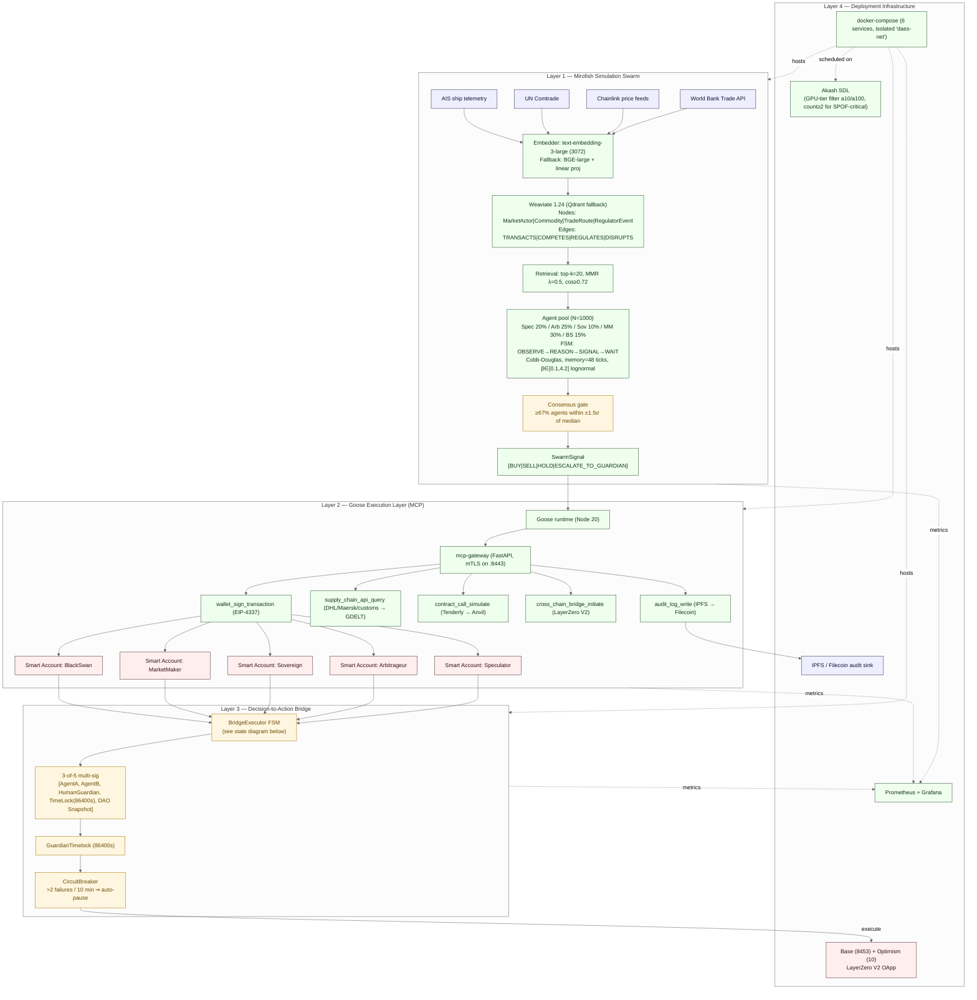
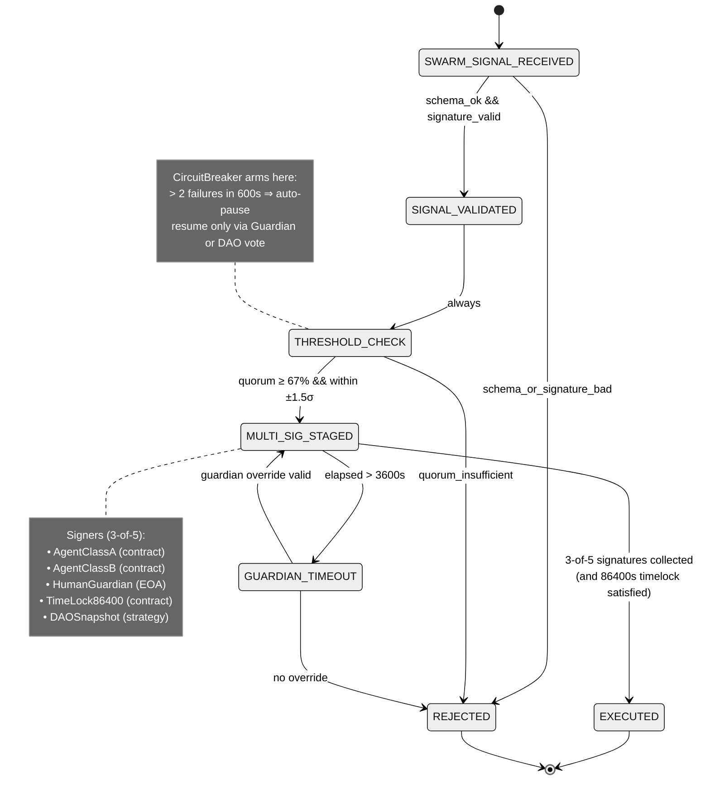

# DAES Architecture

Two Mermaid diagrams: a **system flowchart** across all 4 layers, and a **state diagram** for the Bridge FSM.

## System Flowchart

## Bridge FSM (state diagram)

## Reading guide

- **Solid arrows** = synchronous data/control flow on the critical path.
- **Dashed arrows** = infrastructure/observability relationships (not on the transaction critical path).
- Every service in the flowchart corresponds 1:1 to a block in [`../deploy/docker-compose.yaml`](../deploy/docker-compose.yaml) and [`../deploy/akash/deploy.yaml`](../deploy/akash/deploy.yaml).
- Every threshold/timeout is sourced from [`../spec/components.yaml`](../spec/components.yaml) — no magic numbers inline.
